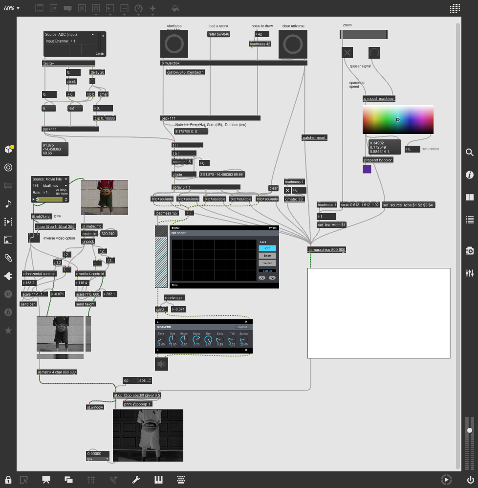
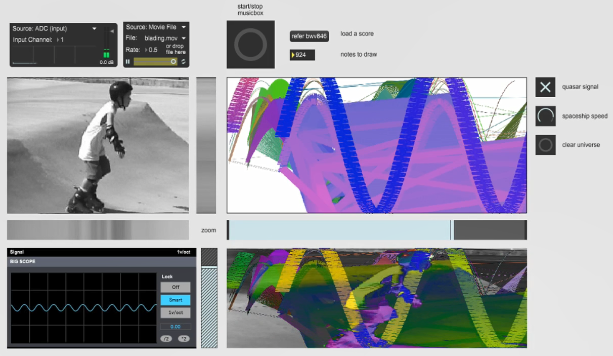
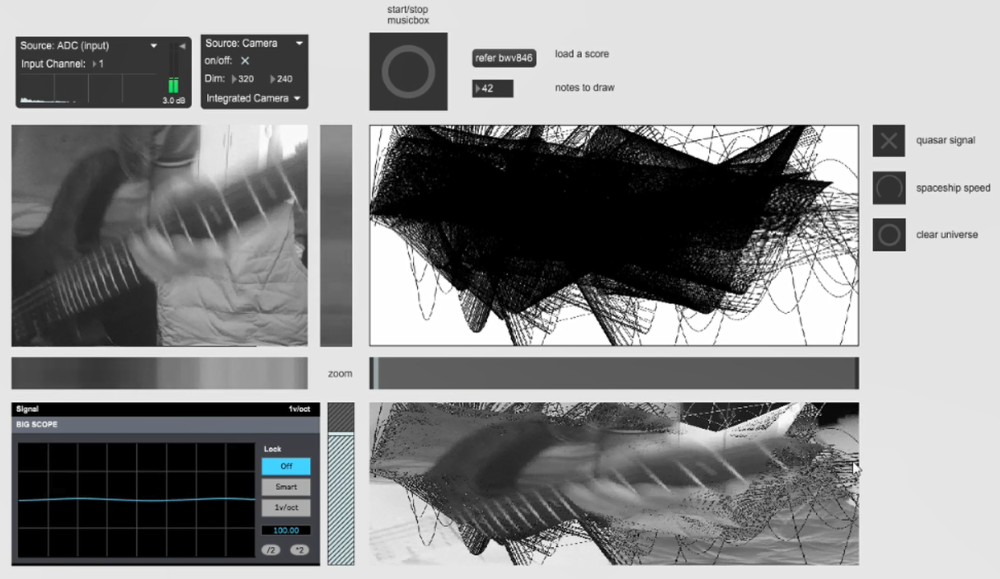

# Cosmic-Echoes

See and hear the echoes from the universe.

**See video demo [here](https://youtu.be/dfShHa8C7t0).**

To run the patch, open *Cosmic Echoes.maxpat* in MAX.

This is an imagination of throwing some voice, music or whatever you want into the universe, and you get some echo like things. Also, there is a device that detecting the wave form of what you get, displaying the cosmic light somehow colorful... Also, the location of the sound and the waveform you get is related to what you video device is capturing. Through the river of time, those sounds are traveling to you from light-years away.

This patch is a large extension from the "Squiggle Animation" coursework in the [MAX course on Kadenze](https://www.kadenze.com/courses/programming-max-structuring-interactive-software-for-digital-arts-i/info). There are two interactive parts. One is based on the audio input while another is based on the video input. Then the two parts affects each other, modifying the parameters of another's processing, finally give you a feedback mixed them all.

The patch gets the fundamental frequency whenever the input device detects a change in pitch, and then synthesizes a sine wave of that frequency, whose duration time is determined by the time it has waited for that change (also a limit set in case of a too long time). This gives a feeling of sound traveling through the time and space. Additionally, the pan of the sound is based on the horizontal centroid of the input video. And you could either load a music score for the synthesizer or play with whatever audio input device, talking to a built-in mic on the laptop for the simplest case.

For the video part, the choice is also on you whether you used your camera or you load a video clip to the patch. The patch would calculate the horizontal and vertical centroid of your video input. The horizontal centroid determines the pan of the sound as mentioned above. And the vertical centroid determines the vertical location of the sine wave to be drew down. Then, the input video and the sine waves are combined together through a absolute value difference operation.

Besides the input source of audio and video, there are also some parameters left to the player to change, affecting the visual effects of the final output. With these interacting with each other, we finally get some cosmos feeling on the video part and an echo like sound character on the audio part. And that is why I named this patch "Cosmic Echoes".

-------

## Credits

* The audio and video input bpatchers are from the help patch within MAX.

* The "mood_machine" patch are from the help patch within MAX.

* The horizontal and vertical centroid patch credit to Matthew Wright.

* The "draw-sine-squiggle.2" patch and "blip+squiggle" patch modified on the version of Matthew Wright.

* The video clips are built-in ones from MAX.
